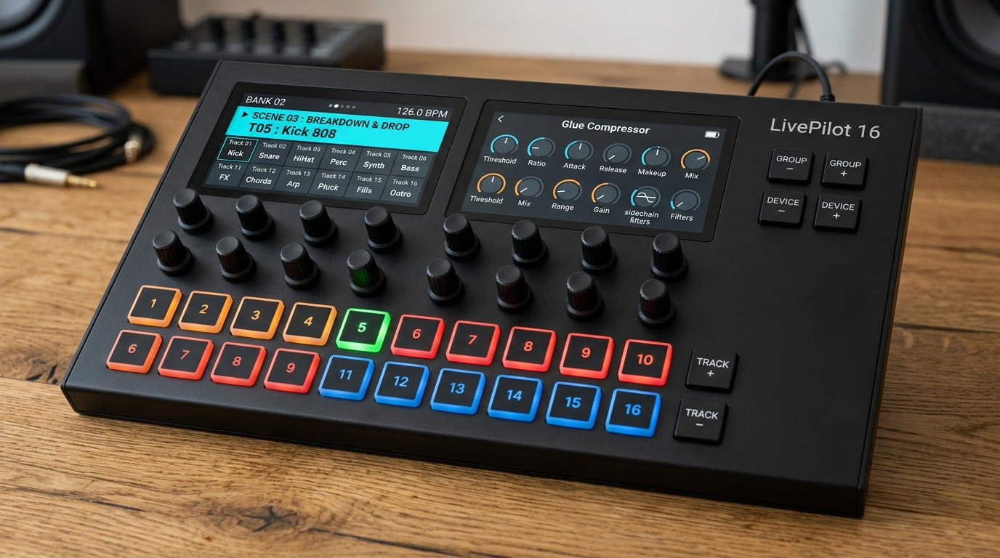

# CAHIER DES CHARGES TECHNIQUE & FONCTIONNEL
# LivePilot 16
> **Slogan :** *"Ne regardez plus l'écran, pilotez votre son."*  
> *(Alternative internationale : "Eyes off the screen, hands on the sound.")*

**Statut du projet :** Officiel — Version 1.2  
**Auteur / Concepteur :** Équipe LivePilot 16  
**Dépôt :** `LivePilot16`  
**Environnement de développement unifié :** Antigravity IDE

---

## 1. Vision, Identité & Concept Produit

### 1.1. Philosophie du Système
**LivePilot 16** est une surface de contrôle physique matérielle haut de gamme dédiée à la performance **Live** et à la production sous **Ableton Live**.  
Elle permet au musicien et au producteur de naviguer instantanément dans l'arborescence :
$$\text{Projet} \longrightarrow \text{Banque de Pistes} \longrightarrow \text{Piste (Track)} \longrightarrow \text{Plugin (Device)} \longrightarrow \text{16 Paramètres}$$

Le mot d'ordre absolu est : **aucune manipulation de souris et aucun coup d'œil vers l'écran de l'ordinateur ne sont nécessaires**. Le contrôleur fournit tous les repères visuels, tactiles et chromatiques en temps réel.

### 1.2. Aperçu Visuel du Produit & Agencement de Façade


* **2 Écrans TFT couleur 3.5" IPS (480x320 chacun, surface totale 960x320 px)** placés côte à côte (**aucun bouton satellite autour**) :
  * **Écran Gauche (Vue Mix & Session)** : Groupe actif, ruban miroir 2x8 des 16 pistes et grand bandeau de la piste active.
  * **Écran Droit (Vue Plugins & Paramètres)** : Nom du device, pagination et 16 blocs de paramètres avec jauges graphiques.
* **16 Encodeurs rotatifs crantés infinis** avec knobs en aluminium moleté noir, disposés en **2 rangées horizontales de 8** sous les écrans.
* **16 Boutons de pistes RGB en silicone** disposés en **2 rangées horizontales de 8** (pistes 1 à 8 en rangée haute, pistes 9 à 16 en rangée basse).
* **Exactement 6 boutons de navigation** regroupés en un bloc dédié ergonomique (3 rangées de 2 touches) :
  * `TRACK -` / `TRACK +` : Pagination par banques de 16 pistes.
  * `GROUP -` / `GROUP +` : Macro-navigation directe de groupe en groupe / bus en bus.
  * `DEVICE -` / `DEVICE +` : Parcours intelligent des plugins assignés (conditionné à $> 1$).

---

## 2. Prérequis Logiciels (100% Gratuits & Open-Source) & Rôle d'Antigravity

> [!NOTE]
> **Confirmation :** **L'intégralité du projet peut être développée, compilée, déployée et testée directement depuis Antigravity.**  
> Aucun logiciel payant n'est requis. Antigravity orchestre le code C++, les compilations de firmware, l'écriture du script Python Ableton, la génération des modèles 3D et les fichiers de PCB.

Le tableau ci-dessous détaille les outils gratuits nécessaires pour chaque brique du projet :

| Phase / Brique Technique | Outil Requis (100% Gratuit) | Licence | Rôle de l'Outil | Rôle d'Antigravity dans cette Phase |
|---|---|---|---|---|
| **1. Firmware ESP32-S3 (HAL, TinyUSB, Écran)** | **PlatformIO Core (CLI)** (`pip install platformio`) | Apache 2.0 (Gratuit) | Gestionnaire de dépendances C++, chaîne de compilation GCC Xtensa, flash USB et moniteur série. | • Écrit tout le code C++ (drivers I2C MCP23017, LovyanGFX, TinyUSB).<br>• Compile via `pio run` et flashe l'ESP32-S3 via `pio run -t upload`.<br>• Surveille les logs de debug série. |
| **2. Intégration Ableton (Remote Script)** | **Python 3.11 / 3.7** (déjà installé) + **Ableton Live 11/12** | PSF (Python gratuit) / Hôte utilisateur | Moteur d'exécution natif du Live Object Model (LOM) dans Ableton. | • Développe l'architecture modulaire du script Python.<br>• Déploie directement dans `C:\Users\comme\Documents\Ableton\User Library\Remote Scripts\LivePilot16\`.<br>• Analyse en temps réel le fichier `Log.txt` d'Ableton pour le débuggage. |
| **3. Schématique & Circuit Imprimé (PCB)** | **KiCad EDA v8** | GPLv3 (Gratuit & Open-Source) | Saisie de schéma électronique, routage PCB 2 couches et export des fichiers de fabrication Gerber/Drill. | • Conçoit les schémas électroniques et netlists.<br>• Écrit des scripts Python KiCad (`pcbnew`) pour le placement automatique des 16 encodeurs et des 16 boutons en matrice régulière.<br>• Génère les fichiers Gerber prêts pour JLCPCB. |
| **4. Modélisation 3D du Boîtier** | **OpenSCAD** (ou **FreeCAD** / **build123d**) | GPLv2 / LGPL (Gratuit & Open-Source) | Logiciel de CAO 3D paramétrique basé sur des scripts de code. | • Génère le script de modélisation 3D paramétrique (`.scad`) du boîtier incliné à 15° avec les découpes exactes pour les composants.<br>• Exporte les fichiers `.stl` et `.step` prêts à trancher. |
| **5. Tranchage & Impression 3D** | **Bambu Studio**, **PrusaSlicer** ou **OrcaSlicer** | AGPLv3 (Gratuit & Open-Source) | Découpage en couches du fichier STL pour votre imprimante 3D. | • Fournit les paramètres d'impression optimaux (hauteur de couche 0.2mm, remplissage gyroid 25%, supports arborescents). |

---

## 3. Nomenclature Matérielle Détaillée (BOM) & Estimation Budgétaire

> [!IMPORTANT]
> Conformément aux exigences du projet, les composants sélectionnés privilégient **la durabilité, la précision tactile et l'absence totale de jeu mécanique**, indispensables pour un usage scénique intensif.

### 3.1. Tableau Détaillé des Composants

| Sous-système | Référence & Modèle Exact | Caractéristiques Techniques Clés | Justification Qualité Pro | Qté | Prix Unit. (€) | Prix Total (€) | Liens d'Achat & Distributeurs |
|---|---|---|---|:---:|:---:|:---:|---|
| **Microcontrôleur** | **Espressif ESP32-S3-DevKitC-1-N16R8** | Dual-Core Xtensa LX7 @ 240 MHz, 16 Mo Flash Quad SPI, 8 Mo Octal PSRAM, USB OTG natif (D+/D-) | Puissance suffisante pour gérer l'affichage SPI DMA, 4 expandeurs I2C et l'USB-MIDI sans latence | 1 | 14,50 € | **14,50 €** | [Mouser ESP32-S3](https://www.mouser.fr/c/?q=ESP32-S3-DevKitC-1-N16R8) / [DigiKey](https://www.digikey.fr/fr/products/detail/espressif-systems/ESP32-S3-DEVKITC-1-N16R8/15978184) |
| **Encodeurs Rotatifs** | **Bourns PEC11R-4220F-S0024** | 24 pas / 24 impulsions par tour, rotation continue infinie, axe méplat (D-shaft) 6 mm, longueur 20 mm, switch poussoir intégré (push), durée de vie 30 000 cycles | Détente crantée nette et feutrée (haptic feedback pro), aucun saut de valeur, axe métal rigide sans jeu | 16 | 3,40 € | **54,40 €** | [Mouser Bourns PEC11R](https://www.mouser.fr/ProductDetail/Bourns/PEC11R-4220F-S0024?qs=Z1xFfO3k2Ww%252BcD3P22v%252B%252Bw%3D%3D) / [DigiKey](https://www.digikey.fr/fr/products/detail/bourns-inc/PEC11R-4220F-S0024/4499648) |
| **Knobs d'Encodeurs** | **Knobs Aluminium Moleté CNC Ø16mm x H15mm (axe méplat 6mm)** | Corps en aluminium anodisé noir taillé dans la masse, flancs moletés diamant (diamond knurl), repère blanc usiné, serrage vis sans tête | Toucher lourd, adhérence parfaite même avec les doigts moites en live, look synthé modulaire / Elektron | 16 | 2,20 € | **35,20 €** | [Thonk Audio Knobs](https://www.thonk.co.uk/product-category/knobs/) / [Banzai Music](https://www.banzaimusic.com) / [AliExpress Knurled Knobs 6mm](https://fr.aliexpress.com/w/wholesale-knurled-aluminum-knobs-6mm.html) |
| **Boutons Pistes (Touches)** | **Touches silicone 15x15 mm translucides (style Launchpad) + Switches Omron B3F-4055** | Matrice silicone ou touches individuelles à course courte (1.5mm), contact or scellé, force d'activation 1.5N, 1 000 000 cycles | Déclenchement franc, silencieux et ultra-robuste, diffusion homogène de la lumière sans point chaud | 16 | 2,50 € | **40,00 €** | [Mouser Omron B3F-4055](https://www.mouser.fr/ProductDetail/Omron-Electronics/B3F-4055?qs=Fk4f1vQd8Fk4f1vQd8) / [Adafruit Silicone Keypad](https://www.adafruit.com/product/1611) |
| **Éclairage RGB Pistes** | **LEDs Neopixel WS2812B-Mini (3535 ou 5050)** | LED RGB adressable 24-bit (16.7M couleurs), protocole unifilaire 800 kHz, montage sous chaque touche | Rendu colorimétrique fidèle des 60+ nuances d'Ableton Live avec contrôle individuel de l'intensité | 16 | 0,40 € | **6,40 €** | [Mouser Worldsemi WS2812B](https://www.mouser.fr) / [AliExpress WS2812B Mini 3535](https://fr.aliexpress.com) |
| **Boutons Navigation** | **Switches tactiles APEM / E-Switch TL1100 avec cabochon gravé** | Course nette, retour tactile audible, cabochon carré 10x10 mm avec légende `TRACK -/+`, `GROUP -/+`, `DEV -/+` | Robustesse éprouvée pour les commandes fréquentes de pagination et de macro-navigation | 6 | 1,80 € | **10,80 €** | [Mouser TL1100 E-Switch](https://www.mouser.fr/c/?q=TL1100) / [DigiKey](https://www.digikey.fr) |
| **Écrans TFT (Double Écran)** | **2x Modules TFT LCD 3.5" IPS ILI9488 (480x320)** | Résolution combinée 960x320 px, dalle IPS grand angle (178°/178°), bus SPI partagé 40MHz, rétroéclairage PWM | Lisibilité exceptionnelle : séparation totale de la Vue Mix/Session (gauche) et de la Vue Plugins (droite) | 2 | 16,00 € | **32,00 €** | [BuyDisplay 3.5" ILI9488 SPI](https://www.buydisplay.com) / [Waveshare 3.5 LCD](https://www.waveshare.com) / [AliExpress](https://fr.aliexpress.com) |
| **Expandeurs I/O** | **Microchip MCP23017-E/SO (ou SP DIP-28)** | 16 broches E/S bidirectionnelles par circuit, bus I2C jusqu'à 1.7 MHz, 3 bits d'adresse (jusqu'à 8 circuits sur le même bus), 2 broches d'interruption configurable | Composant industriel référence, élimine le lag de scrutation grâce aux interruptions physiques | 4 | 1,75 € | **7,00 €** | [Mouser MCP23017](https://www.mouser.fr/ProductDetail/Microchip-Technology/MCP23017-E-SO?qs=E21W9O9mUv5x2c1x%252B%2FmU%2Fg%3D%3D) / [DigiKey](https://www.digikey.fr/fr/products/detail/microchip-technology/MCP23017-E-SO/894272) |
| **Connectique & Sécurité** | **Embase USB-C femelle traversante blindée + Diode TVS USBLC6-2SC6** | Connecteur 16 broches USB-C (5.1k CC pull-down), protection contre les décharges électrostatiques (ESD) et surtensions | Évite de griller l'ESP32 lors des branchements à chaud en live sur des alimentations douteuses | 1 | 4,50 € | **4,50 €** | [Mouser Amphenol USB-C](https://www.mouser.fr) / [LCSC Electronics](https://www.lcsc.com) |
| **Circuit Imprimé (PCB)** | **PCB 2 couches sur-mesure (JLCPCB / PCBWay)** | FR4 double face épaisseur 1.6mm, finition ENIG (or chimique) ou HASL sans plomb, sérigraphie blanche haute résolution | Supprime 100% des câbles volants, élimine le bruit I2C/SPI et garantit une solidité mécanique totale | 1 lot (5 pcs) | 25,00 € | **25,00 €** | [JLCPCB](https://jlcpcb.com) / [PCBWay](https://www.pcbway.com) |
| **Boîtier & Finition 3D** | **Filament PETG mat ou PLA-CF (fibre de carbone) + 20 inserts laiton M3** | Châssis incliné 15°, rigidité thermique et mécanique, inserts thermo-insérés au fer à souder, visserie BTR inox noire M3 | Finition pro noire mate anti-reflets scéniques, démontage et maintenance illimités sans abîmer le plastique | 1 lot | 22,00 € | **22,00 €** | [Prusa Filament / Polymaker](https://polymaker.com) / [Amazon Inserts M3](https://www.amazon.fr) |
| **Pieds & Visserie** | **Pieds antidérapants silicone 3M Bumpon + Visserie M3** | 4 patins en élastomère haute adhérence, vis à tête fraisée bombée M3x8mm | Stabilité absolue sur table de mixage ou stand de live lors de rotations vives des encodeurs | 1 lot | 6,00 € | **6,00 €** | [Mouser 3M Bumpon](https://www.mouser.fr) |

---

### 3.2. Récapitulatif Budgétaire

* **Total Matériel Estimé (Qualité Pro Double Écran) :** **258,00 € TTC**  
* **Fourchette budgétaire réaliste :** **230 € à 290 €** (selon regroupement de commandes et options de finition).

---

## 4. Architecture Logicielle & Découpage en 3 Piliers

```
┌────────────────────────────────────────────────────────────────────────┐
│                        LIVEPILOT 16 : ARCHITECTURE                     │
│                                                                        │
│   ESP32-S3 FIRMWARE (C++17 / FreeRTOS / PlatformIO)                    │
│   ┌─────────────────────────────────┐   ┌───────────────────────────┐  │
│   │ PILIER 1 : COUCHE MATÉRIELLE    │   │ PILIER 2 : PROTOCOLE & USB│  │
│   │ • 4x MCP23017 (I2C + Interrupt) │   │ • TinyUSB Native MIDI     │  │
│   │ • 16x Encodeurs (Gray Machine)  │◄─►│ • Parser SysEx rapide     │  │
│   │ • 16x RGB Buttons + 4x Nav      │   │ • Dual-Core Task Sharing  │  │
│   │ • Écran TFT 480x320 SPI (DMA)   │   │ • Cache d'état local      │  │
│   └─────────────────────────────────┘   └─────────────▲─────────────┘  │
└───────────────────────────────────────────────────────┼────────────────┘
                                                        │ USB-C (USB-MIDI)
┌───────────────────────────────────────────────────────┼────────────────┐
│   ABLETON LIVE 11 / 12 (HOST)                         │                │
│   ┌───────────────────────────────────────────────────▼─────────────┐  │
│   │ PILIER 3 : MIDI REMOTE SCRIPT ABLETON (PYTHON 3)                │  │
│   │ • Surveillance dynamique du Live Object Model (LOM)             │  │
│   │ • Tracks, Devices, 16 Parameters, RGB Colors                    │  │
│   │ • Envoi SysEx non-bloquant & CC relatifs                        │  │
│   │ • Plug & Play automatique dans les Préférences MIDI             │  │
│   └─────────────────────────────────────────────────────────────────┘  │
└────────────────────────────────────────────────────────────────────────┘
```

### Pilier 1 : Couche Matérielle (ESP32-S3 / C++17)
* **Lecture des encodeurs** :
  * Les 32 signaux A/B sont reliés aux ports GPIO des MCP23017.
  * Les broches `INTA`/`INTB` sont câblées sur les GPIO 4 et 5 de l'ESP32-S3.
  * À chaque impulsion, une routine d'interruption légère réveille la tâche Core 0 qui lit l'état du port et calcule le déplacement en quadrature via une table de transition à 4 états (Gray Code). Zéro rebond, zéro pas manqué.
* **Affichage TFT ILI9488** :
  * Utilisation de **LovyanGFX** en mode SPI DMA double-tampon (Double Buffering).
  * Les mises à jour de valeurs numériques utilisent des zones rectangulaires partielles ("dirty rectangles") évitant tout balayage plein écran pour maintenir un rafraîchissement $> 60\text{ fps}$.
* **LEDs RGB** :
  * Pilotage des 16 WS2812B via le périphérique RMT (Remote Control) matériel de l'ESP32-S3 (temps CPU = 0).

### Pilier 2 : Firmware & Protocole USB (ESP32-S3 / C++17)
* **USB-MIDI Natif (TinyUSB)** :
  * Reconnu instantanément comme interface audio/MIDI USB Class Compliant par Windows, macOS et Linux sans aucun pilote propriétaire.
* **Encodage Relatif des Encodeurs** :
  * Émission de messages Control Change (CC) au format **Relative Signed Bit** ou **Two's Complement** :
    * Rotation horaire rapide : valeur proportionnelle $+1, +2, +5$
    * Rotation anti-horaire rapide : valeur proportionnelle $-1, -2, -5$
    * Avantage : résolution fine sur réglage lent, accélération dynamique sur rotation rapide, et **aucun saut de valeur** lors du changement de piste ou de plugin.
* **Trames SysEx Compactes (Ableton $\leftrightarrow$ ESP32-S3)** :
  * Entête SysEx : `F0 00 21 45 [Type] [Données...] F7`
  * Types de trames :
    * `0x01` : Synchronisation Banque (Index banque, Nb total de pistes).
    * `0x02` : Piste active (Numéro, Nom UTF-8, Couleur R, G, B).
    * `0x03` : Palette des 16 pistes de la banque active (16 x Couleur R, G, B).
    * `0x04` : Device actif (Numéro, Nom, Index/Total plugins de la piste).
    * `0x05` : Métadonnées des 16 paramètres (Index, Nom, Valeur textuelle affichée, Valeur flottante 0-127).
    * `0x06` : Scène active & Tempo (Index, Is_Playing, Tempo BPM int/déc, Couleur R, G, B, Nom UTF-8).

### Pilier 3 : MIDI Remote Script Ableton Live (Python 3)
* **Installation transparente** : Le dossier `LivePilot16/` est déposé dans `C:\Users\comme\Documents\Ableton\User Library\Remote Scripts\LivePilot16\`.
* **Écouteurs temps réel (`Listeners`)** :
  * `song.view.add_selected_track_listener` : synchronise instantanément la piste.
  * `track.add_color_listener` : met à jour la couleur LED du bouton et le bandeau d'écran.
  * `track.view.add_selected_device_listener` : bascule les 16 encodeurs sur le nouveau plugin.
  * `device.parameters.value_listener` : renvoie la nouvelle valeur en cas d'automation ou de modification à la souris.
* **Compatibilité** : Conçu pour s'exécuter de façon transparente sur **Ableton Live 11 (Python 3.7)** et **Ableton Live 12 (Python 3.11)**.

---

## 5. Ergonomie de Scène & Visibilité des Pistes

### 5.1. Organisation du Double Écran 3.5" (2x 480x320 = 960x320 px) & Ergonomie Séparée

L'architecture à deux écrans couleur IPS séparés apporte la clarté visuelle ultime pour le live :
* **ÉCRAN GAUCHE (480x320 - CS GPIO 10)** : Dédié au **Mix & Session** (aligné au-dessus des 16 touches de pistes).
* **ÉCRAN DROIT (480x320 - CS GPIO 38)** : Dédié aux **Plugins & Sound Design** (aligné au-dessus des 16 encodeurs rotatifs).

`	ext
┌──────────────────────────────────────────────────┐  ┌──────────────────────────────────────────────────┐
│           ÉCRAN GAUCHE : MIX & SESSION (2x8)     │  │        ÉCRAN DROIT : PLUGINS & PARAMS (2x8)      │
├──────────────────────────────────────────────────┤  ├──────────────────────────────────────────────────┤
│ [BANK 02]       [GRP] DRUMS            126.0 BPM │  │ ACTIVE DEVICE : [D02/03] Glue Compressor         │
├──────────────────────────────────────────────────┤  ├──────────────────────────────────────────────────┤
│ ▶ SCÈNE 03 : BREAKDOWN & LONG DROP (REFRAIN)     │  │ RANGÉE HAUTE (Encodeurs 1 à 8) :                 │
│ (Police condensée pour texte long, FOND ABLETON) │  │ [E01]  [E02]  [E03]  [E04]  [E05]  [E06]  [E07]  [E08] │
├──────────────────────────────────────────────────┤  │ Thres  Ratio  Attak  Relea  Makeu  Dry/W  Range  Sidec │
│ >>> T23 : [GRP] DRUM BUS <<<                     │  │ -18dB   4:1    1ms   0.2s   +4dB   100%   -inf   On    │
│ (Bandeau Piste Active / Blanc si non assigné)    │  ├──────────────────────────────────────────────────┤
├──────────────────────────────────────────────────┤  │ RANGÉE BASSE (Encodeurs 9 à 16) :                │
│ RUBAN MIROIR 2x8 (Numéros & Noms ultra-lisibles) │  │ [E09]  [E10]  [E11]  [E12]  [E13]  [E14]  [E15]  [E16] │
│ R1: [17:Kick] [18:Snar] [19:HiHt] [20:Clap]...   │  │ HPFrq  Clip   Macr1  Macr2  Macr3  Macr4  Macr5  Macr6 │
│ R2: [25:Bass] [26:Synt] [>23:Drum<] [28:Vox]...  │  │ 120Hz   On    50%    25%    75%    0%     100%   ---   │
└──────────────────────────────────────────────────┘  └──────────────────────────────────────────────────┘
`

#### Réponse au Défi Ergonomique : Comment identifier la piste DRUM (Piste 23) en 1 seconde ?
1. **Correspondance spatiale 1:1 (Ruban Miroir 2x8 sur l'Écran Gauche)** :
   * L'écran de gauche est placé directement au-dessus des 16 touches de sélection.
   * La rangée supérieure de touches physiques correspond **strictement aux 8 premières cases du ruban écran**.
   * En Banque 2 (pistes 17 à 32), la case 7 affiche en couleur : `[23:DRUM]`.
   * L'œil voit la case 7 sur l'écran gauche $\longrightarrow$ la main tape le 7ᵉ bouton de la rangée haute. **Zéro calcul mental, repère instantané**.
2. **Sérigraphie du châssis en double repère** :
   * Au-dessus des touches : `1 (17)`, `2 (18)`, `3 (19)`, ..., `7 (23)`, `8 (24)`.
3. **Macro-saut instantané via `GROUP +` / `GROUP -`** :
   * Si la piste 23 est le groupe batterie, l'artiste n'a même pas besoin de chercher : une pression sur `GROUP +` saute directement sur la piste 23 et aligne automatiquement la banque !

---

### 5.2. Fonctionnement du Passage d'une Banque à l'Autre
Chaque banque gère un bloc de **16 pistes contiguës** :
* **Banque 01** : Pistes 01 à 16
* **Banque 02** : Pistes 17 à 32 (la piste 23 se trouve ici)
* **Banque 03** : Pistes 33 à 48
* **Banque 04** : Pistes 49 à 64...

Le passage de banque s'opère selon 3 mécanismes complémentaires :
1. **Par les boutons `TRACK -` et `TRACK +`** :
   * Un appui sur `TRACK +` incrémente la banque (ex: Banque 1 $\rightarrow$ Banque 2).
   * Les 16 boutons RGB adoptent instantanément les 16 couleurs des pistes 17 à 32.
   * L'écran affiche en haut `BANK 02 [PISTES 17 À 32]`.
2. **Par les boutons `GROUP -` et `GROUP +` (Saut automatique de banque)** :
   * Si vous êtes en Banque 1 sur la piste 5 et que vous pressez `GROUP +` pour aller au groupe suivant (situé en piste 23 en Banque 2) :
   * LivePilot 16 détecte le changement de bloc et **bascule automatiquement la banque en Banque 2** ! La piste 23 s'allume immédiatement sur le contrôleur.
3. **Par sélection directe dans Ableton (Follow Selection)** :
   * Tout clic dans Ableton Live (ou déclenchement depuis un Launchpad/Push) sur une piste hors banque force LivePilot 16 à commuter automatiquement sur la banque appropriée.

---

### 5.3. Agencement Strict & Ergonomie Aérée de l'Interface Physique
L'interface de **LivePilot 16** a été calibrée pour offrir un confort maximal et éliminer toute fausse manipulation sur scène :
1. **Double Écran IPS 3.5" (Surface 960x320 px)** : Positionné au centre supérieur (Écran Gauche = Mix & Session 2x8, Écran Droit = Plugins & Paramètres 2x8).
2. **16 Encodeurs Rotatifs (2 rangées de 8)** : Entraxe généreux de **32 mm** (au lieu des 24-26 mm habituels) pour permettre une prise en main des boutons avec les doigts sans heurter les potentiomètres voisins.
3. **16 Boutons de Pistes RGB (2 rangées de 8)** : Alignés 1:1 sous les encodeurs avec le même pas aéré de **32 mm** (Pistes 1 à 8 en rangée 1, Pistes 9 à 16 en rangée 2).
4. **6 Boutons de Navigation Dédiés (Positionnement Scénique Réflexe)** :
   * **`TRACK +`** : Placé directement **à l'extrémité droite de la Rangée 1 des pads** (Pistes 1 à 8), au même niveau physique !
   * **`TRACK -`** : Placé directement **à l'extrémité droite de la Rangée 2 des pads** (Pistes 9 à 16), au même niveau physique !  
     *Avantage scénique :* La main navigue entre les banques de pistes sans jamais quitter la rangée des pads.
   * **Cluster Supérieur Droit (4 touches)** :
     * `GROUP -` / `GROUP +` : Macro-navigation directe de groupe en groupe / bus en bus.
     * `DEVICE -` / `DEVICE +` : Navigation intelligente entre plugins assignés (condition $> 1$).
5. **Identité Visuelle & Châssis** : Titre du produit **`LivePilot 16`** gravé au laser dans le coin supérieur droit. Châssis monobloc incliné à 15°.

---

### 5.3. Règle Fondamentale : Détection & Signalement des Pistes Non Assignées
> [!IMPORTANT]
> **RÈGLE SCÉNIQUE MAJEURE — TOUCHE BLANCHE SUR PISTE VIERGE :**
> Quand l'utilisateur sélectionne une piste (ex: Piste 5) en appuyant sur son bouton physique :
> * **Cas 1 : Piste avec assignation(s)** (au moins un instrument ou rack d'effets configuré avec des paramètres contrôlables) :  
>   Le bouton s'illumine à **100% dans la couleur exacte de la piste sous Ableton** avec un effet de pulsation douce (breathing).
> * **Cas 2 : Piste SANS assignation** (aucune assignation de paramètres, piste audio/MIDI vide ou rack sans assignation) :  
>   **LE BOUTON RESTE STRICTEMENT BLANC PUR (`RGB(255, 255, 255)`) !**  
>   * La couleur Ableton d'origine est volontairement masquée pour cette piste sélectionnée tant qu'elle ne possède aucun contrôle physique.
>   * Sur l'écran 480x320, la zone des encodeurs affiche explicitement l'état : `[ AUCUNE ASSIGNATION / NO ASSIGNMENT ]`.
>   * **Bénéfice scénique :** Le musicien sait instantanément, sans regarder son PC, qu'il se trouve sur une piste où les encodeurs n'auront aucune action.

#### Tableau de synthèse d'état des 16 Boutons de Pistes :
| État de la Piste | Couleur LED | Comportement Lumineux | Signification Scénique |
|---|---|---|---|
| **Piste inexistante** (au-delà du total de pistes du set) | Éteint | Off (0% luminosité) | Emplacement libre |
| **Piste existante, non sélectionnée** | Couleur Ableton de la piste | Fixe tamisé (**30% luminosité**) | Piste présente dans le set |
| **Piste sélectionnée AVEC assignations** | Couleur Ableton de la piste | Brillant (**100%**) + Pulsation douce (0.5 Hz) | Piste active et prête à être pilotée |
| **Piste sélectionnée SANS assignation** | **Blanc pur (`#FFFFFF`)** | Brillant (**100%**) fixe ou souffle blanc | **Piste active mais vierge de tout contrôle** |

---

### 5.4. Règle Fondamentale : Parcours Intelligent des Plugins (Filtrage & Condition $> 1$)
> [!IMPORTANT]
> **RÈGLE DU PARCOURS DE DEVICES :**  
> 1. **Filtrage des devices non assignés :**  
>    Les boutons `DEVICE -` et `DEVICE +` ne parcourent **exclusivement que les devices qui possèdent des assignations effectives** pour le contrôleur. Tout device tiers non mappé, utilitaire muet (ex: simple Tuner ou Utility non assigné) ou rack vide est **totalement ignoré**.
> 2. **Condition d'activation stricte ($> 1$ device assigné) :**  
>    Le parcours de devices ne s'active **QUE si la piste sélectionnée comporte STRICTEMENT PLUS D'UN device assigné ($\text{Nombre} > 1$)**.
>    * **Si $\text{Nombre de devices assignés} \le 1$** (soit 0 ou 1 seul plugin assigné) :
>      * Le parcours de device est **désactivé et verrouillé**.
>      * Presser `DEVICE -` ou `DEVICE +` ne produit **aucun effet** (évite les sauts inutiles et les fausses manipulations).
>      * Les rétroéclairages des boutons `DEVICE -` et `DEVICE +` restent **éteints ou très atténués** pour signaler que la navigation est inutile.
>      * Les boutons `DEVICE -` et `DEVICE +` s'illuminent vivement.
>      * La navigation bascule instantanément d'un plugin assigné au suivant, avec mise à jour immédiate des 16 encodeurs et du nom sur l'écran.

---

### 5.5. Traitement des Pistes de Groupe (Group Tracks & Traitements de Bus)
Dans la production moderne et le live sous Ableton, les **Pistes de Groupe** jouent un rôle central pour sculpter des sous-mixages (ex: Bus Batterie, Bus Synthés, Bus Voix). **LivePilot 16** intègre un support de premier ordre pour ces pistes :

1. **Intégration Naturelle dans la Grille des Pistes :**
   * Dans le Live Object Model (LOM), une piste de groupe est reconnue comme une piste à part entière (`is_foldable = True`).
   * Elle occupe sa touche physique dédiée parmi les 16 boutons de la banque, reprenant la couleur attribuée au groupe dans Ableton.
   * Sur l'écran TFT 480x320, l'en-tête affiche automatiquement le badge distinctif **`[GRP]`** (ex: `T04: [GRP] DRUM BUS`), garantissant à l'artiste qu'il intervient sur un sous-mixage global et non sur une piste individuelle.

2. **Pilotage des Devices de Bus (Compresseurs, EQ, Racks de Groupe) :**
   * Lorsque le groupe est sélectionné, `LivePilot 16` observe directement la collection `track.devices` du groupe.
   * Les 16 encodeurs rotatifs se lient immédiatement aux paramètres du plugin actif sur le bus (ex: seuil et ratio d'un Glue Compressor, filtres d'un EQ de groupe).

3. **Application Stricte de la Règle du Bouton BLANC au Groupe :**
   * **Groupe AVEC effets/assignations** (ex: compresseur ou rack présent) : Le bouton brille à 100% dans la couleur du groupe avec l'effet de respiration douce.
   * **Groupe SANS assignation** (simple dossier de rangement sans plugin ou plugins sans macro/paramètre assigné) : **LE BOUTON DU GROUPE S'ALLUME EN BLANC PUR (`#FFFFFF`) !**  
     L'écran indique `[GRP] NOM - NO ASSIGNMENT`. L'artiste sait immédiatement que ce groupe n'a pas de traitement physique assigné.

4. **Application de la Règle de Navigation Device ($> 1$) sur le Groupe :**
   * Si le groupe possède un seul plugin assigné (ex: 1 Glue Compressor), `DEVICE -` et `DEVICE +` restent inactifs et éteints.
   * Si le groupe possède 2 plugins assignés ou plus (ex: EQ Eight + Glue Compressor + Limiteur), les touches `DEVICE -` et `DEVICE +` s'illuminent pour permettre la navigation rapide entre les traitements de bus.

5. **Fonction Scénique Exclusive : Pliage / Dépliage (Fold / Unfold) en 1 Clic :**
   * **1er appui** sur la touche du groupe : sélectionne le groupe et charge ses effets de bus sur les 16 encodeurs.
   * **2nd appui (ré-appui)** sur la touche d'un groupe déjà actif : bascule instantanément l'état plié/déplié dans Ableton (`track.fold_state = not track.fold_state`), permettant de ranger ou déplier les pistes enfants sans jamais toucher à la souris.

---

### 5.6. Macro-Navigation par Groupes (`GROUP -` / `GROUP +`)
Dans les sets live ou projets de production riches comptant 30, 50 ou 80 pistes, naviguer piste par piste est trop lent. **LivePilot 16** intègre un niveau de macro-navigation dédié via les touches **`GROUP -`** et **`GROUP +`** :

1. **Saut Direct de Bus en Bus :**
   * Depuis n'importe quelle piste du set (qu'elle soit isolée ou enfant d'un groupe), presser `GROUP +` saute instantanément au **Groupe suivant** dans le set (ex: passage direct du bus *DRUMS* au bus *BASS*, puis *SYNTHS*, puis *VOX*).
   * Inversement, presser `GROUP -` revient directement au **Groupe précédent**.
2. **Alignement Automatique des Banques de Pistes :**
   * Si le groupe cible est situé dans une autre banque (ex: saut de la piste 6 en Banque 1 vers un groupe situé en piste 22 en Banque 2), **la banque active s'ajuste automatiquement** pour que le groupe et ses pistes environnantes apparaissent immédiatement sur les 16 touches RGB et sur le bandeau de l'écran.
3. **Gestion Intelligente de l'Éclairage :**
   * Si le projet ne contient aucun groupe, les touches `GROUP -` et `GROUP +` restent éteintes/désactivées.
   * Dès qu'au moins un groupe existe, les touches s'éclairent et permettent de focaliser instantanément le mixage global.
4. **Hiérarchie Ergonomique à 4 Niveaux de LivePilot 16 :**
   $$\begin{matrix}
   \textbf{Niveau 1 (Macro)} & : & \texttt{GROUP -} \ / \ \texttt{GROUP +} & \longrightarrow & \text{Navigation entre sections / sous-mixages} \\
   \textbf{Niveau 2 (Banques)} & : & \texttt{TRACK -} \ / \ \texttt{TRACK +} & \longrightarrow & \text{Pagination par blocs de 16 pistes} \\
   \textbf{Niveau 3 (Plugins)} & : & \texttt{DEVICE -} \ / \ \texttt{DEVICE +} & \longrightarrow & \text{Parcours des plugins assignés (si } > 1 \text{)} \\
   \textbf{Niveau 4 (Paramètres)} & : & \textbf{16 Encodeurs Rotatifs} & \longrightarrow & \text{Sculpture fine en temps réel}
   \end{matrix}$$

---

## 6. Feuille de Route Opérationnelle & Commandes Associées

- [x] **Étape 1 : Spécifications complètes, BOM pro & Prérequis logiciels gratuits**
- [ ] **Étape 2 : Initialisation Firmware ESP32-S3 PlatformIO**  
  *Commande :* `pip install platformio` puis `pio project init`
- [ ] **Étape 3 : Développement du MIDI Remote Script Python pour Ableton 11 & 12**  
  *Déploiement direct dans :* `C:\Users\comme\Documents\Ableton\User Library\Remote Scripts\LivePilot16\`
- [ ] **Étape 4 : Protocole SysEx bidirectionnel & Driver d'affichage LovyanGFX**
- [ ] **Étape 5 : Routage PCB sous KiCad v8 & Modélisation 3D OpenSCAD**
