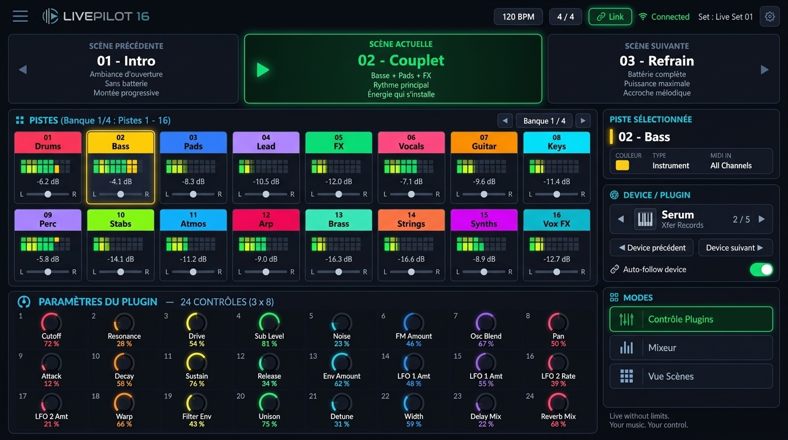

# CAHIER DES CHARGES TECHNIQUE & FONCTIONNEL
# LivePilot 16 — v1.0.0

> **Slogan :** *"Ne regardez plus l'écran d'ordinateur, pilotez votre son."*  
> **International :** *"LivePilot 16 is an interactive stage cockpit for Ableton Live, combining 16-track and 24-plugin macro control with real-time, high-visibility visual feedback on tablet."*

**Statut du projet :** Officiel — Version 1.0.0  
**Auteur / Concepteur :** Audiothor  
**Dépôt GitHub :** `https://github.com/Audiothor/Livepilot16`  
**Environnement de développement :** Antigravity IDE  

---



---

## 1. Vision, Identité & Concept Produit

### 1.1. Philosophie du Système
**LivePilot 16** est un cockpit scénique interactif et une surface de contrôle professionnelle conçue pour **Ableton Live 11 & 12**. Il libère le musicien et le producteur de l'écran d'ordinateur grâce à :
1. **Un affichage tête haute (HUD)** haute lisibilité sur tablette tactile (Android / iOS / PWA).
2. **Un contrôle matériel direct et sans latence** combinant un contrôleur physique de type Novation Launch Control XL (16 pistes, 24 potentiomètres) et Launchpad Pro MK3 (scènes et clips).
3. **Une synchronisation bidirectionnelle instantanée** via un Remote Script natif Python 3 et WebSocket.

$$\text{Ableton Live 12} \xleftrightarrow[\text{WebSocket + SysEx}]{\text{Temps Réel}} \text{LivePilot 16 (Python Script)} \xleftrightarrow{\text{HUD Web}} \text{Tablette Cockpit}$$

---

## 2. Spécifications de l'Interface Tablette (Stage HUD)

L'interface web est calibrée pour un usage scénique (fort contraste, éclairage sombre adapté aux clubs et festivals, typographies bold haute visibilité) :

### 2.1. Barre Supérieure (Header)
* **Bouton Menu** `≡` & **Logo officiel LIVEPILOT 16**.
* **Statut Transport & Sync** :
  * Tempo dynamique (`120 BPM`).
  * Signature rythmique (`4 / 4`).
  * Badge de synchronisation Ableton Link (vert).
  * Indicateur d'état de connexion WebSocket (`Connected` / `Offline`).
  * Nom du Live Set actif (`Set : Live Set 01`).
  * Bouton paramètres `⚙️`.

### 2.2. Bandeau Scénique Hero (Progression à 3 Cartes)
* **Carte Gauche (Scène Précédente)** :
  * Bouton déclencheur `◀`.
  * Libellé `SCÈNE PRÉCÉDENTE`.
  * Numéro et titre (ex. `01 - Intro`).
  * Notes scéniques et repères d'arrangement (ex. *Ambiance d'ouverture, sans batterie, montée progressive*).
* **Carte Centrale (Scène Actuelle — Hero)** :
  * Conteneur proéminent cerclé de vert néon `#00e676` avec lueur diffuse.
  * Icône Play `▶` interactive.
  * Libellé `SCÈNE ACTUELLE`.
  * Numéro et titre en grand format (ex. `02 - Couplet`).
  * Notes scéniques (ex. *Basse + Pads + FX, rythme principal, énergie qui s'installe*).
* **Carte Droite (Scène Suivante)** :
  * Libellé `SCÈNE SUIVANTE`.
  * Numéro et titre (ex. `03 - Refrain`).
  * Notes scéniques (ex. *Batterie complète, puissance maximale, accroche mélodique*).
  * Bouton déclencheur `▶`.

### 2.3. Deck Gauche — Section Pistes (Mixeur 16 Voies)
* **Organisation en grille 8 colonnes x 2 rangées** (Pistes 1 à 8 en haut, Pistes 9 à 16 en bas).
* **Sélecteur de banques** : `◀ Banque 1 / 4 ▶` (permettant de contrôler jusqu'à 64 pistes par banques de 16).
* **Chaque tranche de console comprend** :
  * Bannière de couleur native Ableton avec numéro et nom de la piste.
  * Encadrement doré lumineux `#ffd600` pour la piste sélectionnée.
  * Double VU-mètre stéréo horizontal segmenté à 12 LED (Vert, Jaune, Rouge).
  * Affichage numérique du niveau en décibels (ex. `-4.1 dB`).
  * Ligne de panoramique avec curseur central `L • R`.

### 2.4. Deck Gauche — Paramètres du Plugin (24 Contrôles 3x8)
* **24 potentiomètres rotatifs compacts organisés en 3 rangées de 8**.
* Numérotation explicite `#1` à `#24`.
* Anneau circulaire LED néon multicolore (palette arc-en-ciel contrastée).
* Curseur ponctuel lumineux indiquant la position angulaire exacte.
* Libellé du paramètre VST / Macro en clair (ex. `Cutoff`, `Drive`, `Resonance`).
* Valeur affichée en pourcentage ou unité réelle.
* Contrôle tactile bidirectionnel au glissement (drag).

### 2.5. Volet Latéral Droit (Sidebar)
* **Piste Sélectionnée** :
  * Barre d'accent doré, titre de la piste.
  * Métadonnées : pastille de couleur, type (`Audio`, `MIDI`, `Instrument`), routage MIDI.
* **Device / Plugin** :
  * Carrousel de navigation avec flèches `◀` et `▶`.
  * Icône d'instrument / touches de piano.
  * Nom du plugin actif (ex. `Serum`) et éditeur (ex. `Xfer Records`).
  * Compteur de position dans la chaîne d'effets (ex. `2 / 5`).
  * Boutons de saut rapide : `◀ Device précédent` et `Device suivant ▶`.
  * Interrupteur iOS vert `Auto-follow device` (suit automatiquement le plugin sélectionné dans Live).
* **Sélecteur de Modes** :
  * `Contrôle Plugins` (mode principal actif).
  * `Mixeur`.
  * `Vue Scènes`.
* **Pied de page** : *Live without limits. Your music. Your control.*

---

## 3. Architecture Logicielle & Backend Ableton

### 3.1. Structure du Répertoire
```
LivePilot16/
├── remote_script/LivePilot16/   # [ABLETON] MIDI Remote Script natif Python 3
│   ├── __init__.py              # Factory de surface de contrôle
│   ├── LivePilot16.py           # Logique LOM, listeners d'événements, WebSocket server
│   ├── consts.py                # Constantes et mappings MIDI
│   ├── web_server.py            # Serveur HTTP & WebSocket asynchrone
│   └── web/                     # Application Web Tablette (PWA)
│       ├── index.html           # Structure DOM du Cockpit
│       ├── style.css            # Feuille de style HUD sombre & réactive
│       ├── app.js               # Client WebSocket temps réel & moteur de rendu
│       ├── logo.png             # Logo officiel LIVEPILOT 16
│       └── manifest.json        # Configuration PWA plein écran
│
├── tools/                       # [OUTILS DE DÉPLOIEMENT]
│   ├── install_script.py        # Script d'installation automatique dans Ableton
│   └── cockpit_bridge.py        # Passerelle et utilitaire de test
│
├── firmware/                    # [OPTION MATÉRIELLE ESP32-S3]
│   ├── platformio.ini           # Configuration PlatformIO C++17
│   ├── include/                 # Headers (protocoles, registres)
│   └── src/main.cpp             # Drivers Dual-Core, USB-MIDI, SPI
│
├── hardware/                    # [OPTION ELECTRONIQUE KICAD]
│   ├── gerber/                  # Fichiers de fabrication PCB
│   └── kicad/                   # Schémas et typons
│
├── enclosure/                   # [OPTION CHÂSSIS 3D]
│   └── openscad/                # Modélisation paramétrique inclinée 15°
│
└── doc/                         # [DOCUMENTATION & RENDUS]
    ├── GUIDE_TABLETTE_LIVE.md   # Guide de prise en main sur scène
    └── assets/                  # Visuels et captures d'écran de référence
```

### 3.2. Protocole d'Échange Temps Réel
* **WebSocket bidirectionnel** (`/ws`) port `8080`.
* Messages JSON structurés :
  * `full_sync` : État global du Live Set (tempo, scènes, 16 pistes, 24 paramètres, périphérique actif).
  * `meters` : Télémétrie audio RMS / Peak des 16 pistes (60 fps).
  * `param_value` : Modification de valeur de potentiomètre.
  * `select_track` / `switch_bank` / `select_relative_device` / `fire_relative_scene` : Actions de navigation.

---

## 4. Guide d'Installation Rapide

1. **Déploiement du Remote Script** :
   ```bash
   python tools/install_script.py
   ```
2. **Configuration dans Ableton Live** :
   * Ouvrez `Options > Préférences > Link, Tempo & MIDI`.
   * Sélectionnez `LivePilot 16` dans les Surfaces de contrôle.
3. **Lancement sur la tablette** :
   * Connectez la tablette en Wi-Fi ou par câble USB (tethering modem USB).
   * Ouvrez le navigateur sur `http://[IP_DU_PC]:8080`.
   * Cliquez sur "Ajouter à l'écran d'accueil" pour lancer le Cockpit en plein écran.
