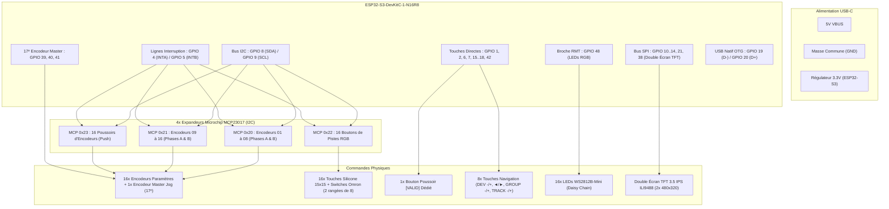

# LivePilot 16 — Guide Complet de Câblage Électronique & Schéma d'Interconnexion

> **Document de Référence Matérielle**  
> Ce guide détaille broche par broche l'intégralité des connexions physiques entre l'ESP32-S3, les 4 expandeurs I2C MCP23017, l'écran TFT ILI9488, les 16 encodeurs, les 16 boutons de pistes RGB et les 6 boutons de navigation.

---

## 1. Vue d'Ensemble de l'Architecture Matérielle

---

## 2. Tableau Complet des Broches de l'ESP32-S3

| Broche ESP32-S3 | Signal / Rôle | Composant Relié | Type I/O | Remarques / Pull-up |
|---|---|---|---|---|
| **GPIO 1** | `PIN_NAV_DEV_PREV` | Bouton Navigation `DEVICE -` | Entrée | Pull-up interne activé (Actif à GND) |
| **GPIO 2** | `PIN_NAV_DEV_NEXT` | Bouton Navigation `DEVICE +` | Entrée | Pull-up interne activé (Actif à GND) |
| **GPIO 4** | `MCP_INTA` | Broches `INTA` des 4x MCP23017 | Entrée IRQ | Interruption matérielle (changement d'état rapide) |
| **GPIO 5** | `MCP_INTB` | Broches `INTB` des 4x MCP23017 | Entrée IRQ | Interruption matérielle (changement d'état rapide) |
| **GPIO 6** | `PIN_NAV_LEFT` | Touche Flèche Gauche `◄` | Entrée | Pull-up interne activé (Navigation scène / page) |
| **GPIO 7** | `PIN_NAV_RIGHT` | Touche Flèche Droite `►` | Entrée | Pull-up interne activé (Navigation scène / page) |
| **GPIO 8** | `I2C_SDA` | Broches `SDA` des 4x MCP23017 | Bidirectionnel | Bus I2C Fast Mode 400kHz (Pull-up 2.2kΩ vers 3.3V) |
| **GPIO 9** | `I2C_SCL` | Broches `SCL` des 4x MCP23017 | Sortie Horloge | Bus I2C Fast Mode 400kHz (Pull-up 2.2kΩ vers 3.3V) |
| **GPIO 10** | `TFT_CS_LEFT` | Broche `CS` de l'Écran TFT Gauche | Sortie SPI | Chip Select Écran Gauche (Vue Mix & Session) |
| **GPIO 11** | `TFT_MOSI` | Broches `SDI / MOSI` des 2 Écrans TFT | Sortie SPI | Données Master Out partagées (40 MHz) |
| **GPIO 12** | `TFT_SCLK` | Broches `SCK / SCLK` des 2 Écrans TFT | Sortie SPI | Horloge SPI partagée (40 MHz) |
| **GPIO 13** | `TFT_DC` | Broches `DC / RS` des 2 Écrans TFT | Sortie SPI | Data / Command partagée |
| **GPIO 14** | `TFT_RST` | Broches `RESET` des 2 Écrans TFT | Sortie | Réinitialisation matérielle commune |
| **GPIO 15** | `PIN_NAV_TRACK_PREV` | Bouton Navigation `TRACK -` | Entrée | Pull-up interne activé (Actif à GND) |
| **GPIO 16** | `PIN_NAV_TRACK_NEXT` | Bouton Navigation `TRACK +` | Entrée | Pull-up interne activé (Actif à GND) |
| **GPIO 17** | `PIN_NAV_GROUP_PREV` | Bouton Navigation `GROUP -` | Entrée | Pull-up interne activé (Actif à GND) |
| **GPIO 18** | `PIN_NAV_GROUP_NEXT` | Bouton Navigation `GROUP +` | Entrée | Pull-up interne activé (Actif à GND) |
| **GPIO 19** | `USB_D-` | Embase USB-C (D-) | USB Différentiel | Port USB OTG natif (USB-MIDI TinyUSB) |
| **GPIO 20** | `USB_D+` | Embase USB-C (D+) | USB Différentiel | Port USB OTG natif (USB-MIDI TinyUSB) |
| **GPIO 21** | `TFT_BL` | Broches `LED / BL` des 2 Écrans TFT | Sortie PWM | Contrôle de luminosité de l'écran par modulation |
| **GPIO 38** | `TFT_CS_RIGHT` | Broche `CS` de l'Écran TFT Droit | Sortie SPI | Chip Select Écran Droit (Vue Plugins & Paramètres) |
| **GPIO 39** | `PIN_ENC17_PUSH` | Poussoir Clic 17ᵉ Encodeur Master | Entrée | Pull-up interne activé (Bascule mode BPM / Jog) |
| **GPIO 40** | `PIN_ENC17_A` | Phase A du 17ᵉ Encodeur Master | Entrée | Quadrature A (Directe MCU sans latence) |
| **GPIO 41** | `PIN_ENC17_B` | Phase B du 17ᵉ Encodeur Master | Entrée | Quadrature B (Directe MCU sans latence) |
| **GPIO 42** | `PIN_BTN_VALID` | Bouton Poussoir Dédié `[VALID]` | Entrée | Pull-up interne activé (Validation / Play Scène) |
| **GPIO 48** | `RGB_DATA` | Broche `DIN` de la 1ère LED WS2812B | Sortie RMT | Signal 800 kHz matériel avec résistance série 330Ω |
| **3V3** | Alimentation 3.3V | VDD des 4x MCP, VCC Écran, Pull-ups | Puissance | Régulateur intégré ESP32-S3 |
| **5V (VBUS)** | Alimentation 5V | VDD des 16 LEDs WS2812B | Puissance | Directement depuis le câble USB-C de l'ordinateur |
| **GND** | Masse commune | Tous composants, encodeurs et boutons | Référence 0V | Plan de masse continu sur le PCB |

---

## 3. Configuration & Câblage des 4 Expandeurs I2C MCP23017

Chaque MCP23017 dispose de 16 broches d'E/S configurables (Port A = GPA0..GPA7, Port B = GPB0..GPB7).  
Les broches de base communes à chaque boîtier MCP23017 sont :
* **Broche 9 (`VDD`)** : Reliée à `3.3V` (avec condensateur de découplage 100 nF céramique à la masse).
* **Broche 10 (`VSS`)** : Reliée à la masse `GND`.
* **Broche 12 (`SCL`)** : Reliée au `GPIO 9` de l'ESP32-S3.
* **Broche 13 (`SDA`)** : Reliée au `GPIO 8` de l'ESP32-S3.
* **Broche 18 (`RESET`)** : Reliée à `3.3V` (maintien à l'état inactif).
* **Broches 19 (`INTA`) et 20 (`INTB`)** : Reliées aux `GPIO 4` et `GPIO 5`.

### 3.1. MCP #0 (Adresse I2C : `0x20`) — Encodeurs Rotatifs 01 à 08
* **Configuration d'adresse physique** :
  * Broche 15 (`A0`) $\longrightarrow$ `GND`
  * Broche 16 (`A1`) $\longrightarrow$ `GND`
  * Broche 17 (`A2`) $\longrightarrow$ `GND`
* **Affectation des broches I/O aux phases A et B** :
  * `GPA0` (Broche 21) : Phase A de l'Encodeur 01
  * `GPA1` (Broche 22) : Phase B de l'Encodeur 01
  * `GPA2` (Broche 23) : Phase A de l'Encodeur 02
  * `GPA3` (Broche 24) : Phase B de l'Encodeur 02
  * `GPA4` (Broche 25) : Phase A de l'Encodeur 03
  * `GPA5` (Broche 26) : Phase B de l'Encodeur 03
  * `GPA6` (Broche 27) : Phase A de l'Encodeur 04
  * `GPA7` (Broche 28) : Phase B de l'Encodeur 04
  * `GPB0` (Broche 1) : Phase A de l'Encodeur 05
  * `GPB1` (Broche 2) : Phase B de l'Encodeur 05
  * `GPB2` (Broche 3) : Phase A de l'Encodeur 06
  * `GPB3` (Broche 4) : Phase B de l'Encodeur 06
  * `GPB4` (Broche 5) : Phase A de l'Encodeur 07
  * `GPB5` (Broche 6) : Phase B de l'Encodeur 07
  * `GPB6` (Broche 7) : Phase A de l'Encodeur 08
  * `GPB7` (Broche 8) : Phase B de l'Encodeur 08
* **Broche commune (C) de chaque encodeur** : Reliée à `GND`. Les pull-ups internes des MCP23017 sont activés par le code.

---

### 3.2. MCP #1 (Adresse I2C : `0x21`) — Encodeurs Rotatifs 09 à 16
* **Configuration d'adresse physique** :
  * Broche 15 (`A0`) $\longrightarrow$ `3.3V`
  * Broche 16 (`A1`) $\longrightarrow$ `GND`
  * Broche 17 (`A2`) $\longrightarrow$ `GND`
* **Affectation des broches I/O** :
  * `GPA0` à `GPA7` : Phases A et B des Encodeurs 09, 10, 11, 12
  * `GPB0` à `GPB7` : Phases A et B des Encodeurs 13, 14, 15, 16
* **Broche commune (C)** : Reliée à `GND`.

---

### 3.3. MCP #2 (Adresse I2C : `0x22`) — 16 Boutons de Pistes RGB
* **Configuration d'adresse physique** :
  * Broche 15 (`A0`) $\longrightarrow$ `GND`
  * Broche 16 (`A1`) $\longrightarrow$ `3.3V`
  * Broche 17 (`A2`) $\longrightarrow$ `GND`
* **Affectation des broches I/O** :
  * `GPA0` (Broche 21) : Bouton Piste 01
  * `GPA1` (Broche 22) : Bouton Piste 02
  * `GPA2` (Broche 23) : Bouton Piste 03
  * `GPA3` (Broche 24) : Bouton Piste 04
  * `GPA4` (Broche 25) : Bouton Piste 05
  * `GPA5` (Broche 26) : Bouton Piste 06
  * `GPA6` (Broche 27) : Bouton Piste 07
  * `GPA7` (Broche 28) : Bouton Piste 08
  * `GPB0` (Broche 1) : Bouton Piste 09
  * `GPB1` (Broche 2) : Bouton Piste 10
  * `GPB2` (Broche 3) : Bouton Piste 11
  * `GPB3` (Broche 4) : Bouton Piste 12
  * `GPB4` (Broche 5) : Bouton Piste 13
  * `GPB5` (Broche 6) : Bouton Piste 14
  * `GPB6` (Broche 7) : Bouton Piste 15
  * `GPB7` (Broche 8) : Bouton Piste 16
* **Câblage des switches** : Chaque switch tactile (Omron B3F) est connecté entre sa broche MCP dédiée et la masse `GND`.

---

### 3.4. MCP #3 (Adresse I2C : `0x23`) — 16 Poussoirs d'Encodeurs (Push Switches)
* **Configuration d'adresse physique** :
  * Broche 15 (`A0`) $\longrightarrow$ `3.3V`
  * Broche 16 (`A1`) $\longrightarrow$ `3.3V`
  * Broche 17 (`A2`) $\longrightarrow$ `GND`
* **Affectation des broches I/O** :
  * `GPA0` à `GPA7` : Contacts poussoirs intégrés des Encodeurs 01 à 08
  * `GPB0` à `GPB7` : Contacts poussoirs intégrés des Encodeurs 09 à 16
* **Câblage** : Chaque contact poussoir est connecté entre sa broche MCP et `GND`.

---

## 4. Câblage des Commandes Directes : 17ᵉ Encodeur Master, Touche [VALID] et 8 Boutons de Navigation

Pour garantir une réactivité instantanée à zéro latence et un temps de réponse critique sur scène, le 17ᵉ encodeur master, le bouton de validation et les 8 touches de navigation sont câblés directement sur des broches GPIO dédiées de l'ESP32-S3 (sans passer par les expandeurs I2C) :

### 4.1. 17ᵉ Encodeur Rotatif Master (BPM / Jog / Défilement) & Clic Poussoir

| Commande | Broche ESP32-S3 | Autre Côté | Emplacement & Rôle |
|---|---|---|---|
| **Phase A** | **GPIO 40** | `GND` (C) | Quadrature A (Incrément / Décrément) |
| **Phase B** | **GPIO 41** | `GND` (C) | Quadrature B (Sens de rotation) |
| **Clic Poussoir (Push)** | **GPIO 39** | `GND` | Bascule de mode : Tempo BPM live $\leftrightarrow$ Défilement scènes/paramètres |

### 4.2. Bouton Dédié de Validation [VALID]

| Commande | Broche ESP32-S3 | Autre Côté | Emplacement & Rôle |
|---|---|---|---|
| **`[VALID]`** | **GPIO 42** | `GND` | Directement sous le 17ᵉ encodeur : Lancement de scène sélectionnée / Validation |

### 4.3. Les 8 Boutons de Navigation Dédiés

| Touche de Navigation | Broche ESP32-S3 | Autre Côté du Switch | Emplacement Physique & Rôle |
|---|---|---|---|
| **`DEVICE -`** | **GPIO 1** | `GND` | **Haut Droit (Rangée du haut, gauche)** : Plugin assigné précédent (si $> 1$) |
| **`DEVICE +`** | **GPIO 2** | `GND` | **Haut Droit (Rangée du haut, droite)** : Plugin assigné suivant (si $> 1$) |
| **`◄` (Flèche Gauche)** | **GPIO 6** | `GND` | **Haut Droit (Directement sous DEV-)** : Scène précédente / Page précédente |
| **`►` (Flèche Droite)**| **GPIO 7** | `GND` | **Haut Droit (Directement sous DEV+)** : Scène suivante / Page suivante |
| **`GROUP -`** | **GPIO 17** | `GND` | **Bas Droit (Niveau Pistes 1-8, gauche)** : Groupe précédent |
| **`GROUP +`** | **GPIO 18** | `GND` | **Bas Droit (Niveau Pistes 1-8, droite)** : Groupe suivant |
| **`TRACK -`** | **GPIO 15** | `GND` | **Bas Droit (Niveau Pistes 9-16, gauche)** : Banque précédente (-16) |
| **`TRACK +`** | **GPIO 16** | `GND` | **Bas Droit (Niveau Pistes 9-16, droite)** : Banque suivante (+16) |

> [!TIP]
> **Ergonomie Réflexe Immédiate :**  
> * **En haut à droite (Face à l'Écran Plugins & Paramètres) :**  
>   * Rangée du haut : `DEVICE -` et `DEVICE +` pour feuilleter les plugins de la piste active.
>   * Juste au-dessous : Flèches `◄` et `►` pour parcourir les scènes ou les pages d'écran.
> * **Colonne 9 (À droite des encodeurs) :**  
>   * En haut : Le 17ᵉ Encodeur Master cranté pour ajuster le tempo BPM en direct.
>   * En bas : Le bouton `[VALID]` pour envoyer instantanément la scène sélectionnée.
> * **En bas à droite (Face aux 16 Touches de Pistes) :**  
>   * Rangée haute : `GROUP -` et `GROUP +` pour sauter instantanément d'un bus/groupe à l'autre.
>   * Rangée basse : `TRACK -` et `TRACK +` pour faire défiler les banques de 16 pistes.

*Chaque entrée utilise la résistance de rappel au 3.3V interne de l'ESP32-S3 (`pinMode(pin, INPUT_PULLUP)`). Aucun composant externe n'est requis.*

---

## 5. Câblage du Ruban de 16 LEDs RGB NeoPixel (WS2812B-Mini)

Les 16 LEDs sont montées sous les touches silicone translucides et sont chaînées en guirlande unifilaire (Daisy-Chain) :

1. **Ligne de Données (`DATA`)** :
   * `GPIO 48` de l'ESP32-S3 $\longrightarrow$ Résistance série $330\ \Omega$ $\longrightarrow$ Broche `DIN` de la LED 01.
   * `DOUT` de LED 01 $\longrightarrow$ `DIN` de LED 02.
   * Répété jusqu'à `DOUT` de LED 15 $\longrightarrow$ `DIN` de LED 16.
2. **Ligne d'Alimentation (`5V / VBUS`)** :
   * Reliée au rail **5V direct de l'USB-C** (courant max pour 16 LEDs à 100% blanc = $16 \times 50\text{ mA} = 800\text{ mA}$, parfaitement dans la plage des ports USB 2.0/3.0 récents et chargeurs).
   * Un condensateur électrolytique de $100\ \mu\text{F} \text{ / } 10\text{V}$ est placé à l'entrée du rail d'alimentation des LEDs pour lisser les appels de courant.
3. **Masse (`GND`)** : Reliée au plan de masse général.

---

## 6. Câblage du Double Écran TFT 3.5" IPS (2x ILI9488 SPI 480x320 = 960x320 px)

Les deux écrans partagent intégralement les lignes de données SPI, d'horloge, de commande et d'alimentation. Seule la broche **Chip Select (`CS`)** est individualisée :

| Broche du Module TFT | Écran Gauche (Vue Mix & Session) | Écran Droit (Vue Plugins & Paramètres) | Rôle & Signal |
|---|---|---|---|
| **VCC** | `3.3V` (ou 5V) | `3.3V` (ou 5V) | Rail d'alimentation logique |
| **GND** | `GND` | `GND` | Masse commune 0V |
| **CS (Chip Select)** | **GPIO 10** (`TFT_CS_LEFT`) | **GPIO 38** (`TFT_CS_RIGHT`) | **Individualisé** : sélectionne l'écran destinataire |
| **RESET** | **GPIO 14** | **GPIO 14** | Réinitialisation matérielle partagée |
| **DC / RS** | **GPIO 13** | **GPIO 13** | Ligne Data / Command partagée |
| **SDI / MOSI** | **GPIO 11** | **GPIO 11** | Bus de données pixels Master Out partagé (40 MHz DMA) |
| **SCK / SCLK** | **GPIO 12** | **GPIO 12** | Horloge SPI partagée (40 MHz) |
| **LED / BL** | **GPIO 21** | **GPIO 21** | Signal PWM partagé pour luminosité synchronisée |
| **SDO / MISO** | *Non connecté* | *Non connecté* | Inutilisé (affichage sans relecture) |

---

## 7. Règles de Protection et Découplage

1. **Découplage haute fréquence** :
   * Chaque circuit intégré (les 4 MCP23017 et le module ESP32-S3) doit avoir un **condensateur céramique CMS 100 nF (X7R)** placé au plus près de ses broches `VDD` et `VSS`.
2. **Tirages I2C** :
   * Deux résistances de **$2.2\ \text{k}\Omega$** doivent être soudées entre la ligne `SDA` (GPIO 8) et `3.3V`, et entre `SCL` (GPIO 9) et `3.3V`.
3. **Protection USB-C** :
   * Les broches `D-` (GPIO 19) et `D+` (GPIO 20) sont protégées contre les décharges électrostatiques (ESD) par une diode double TVS type **USBLC6-2SC6** reliée à la masse.
   * Deux résistances de tirage vers le bas de **$5.1\ \text{k}\Omega$** sont soudées sur les broches `CC1` et `CC2` de l'embase USB-C pour forcer l'ordinateur hôte à délivrer le 5V en mode USB-C vers USB-C standard.
